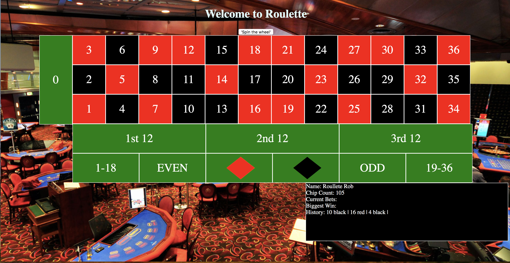

# European Roulette

For my game project I decided to create European Roulette. Roulette is a game of chance played at a table marked off with numbers from 1 to 36, one or two zeros(one zero=European; two zeros=American), and several other sections affording the players a variety of betting opportunities, and having in the center a revolving, dishlike device (roulette wheel) into which a small ball is spun to come to rest finally in one of the 37 dish compartments.

## Deployement Link

https://git.generalassemb.ly/WebDev-Connected-Classroom/blog-autumn-sweaters.git

## Instructions
The player starts with a money value of 100 chips. Bets are made in increments of 5. The game only allows for a maximum of a single 5-chip bet on any single bet. Use the cursor to place the bets you would like, tracking the players money in the bottom right corner. There is no real end game, the player can continue to win & lose enjoying the thrill of casino style roulette.

## Technologies

HTML
CSS
Javascript

